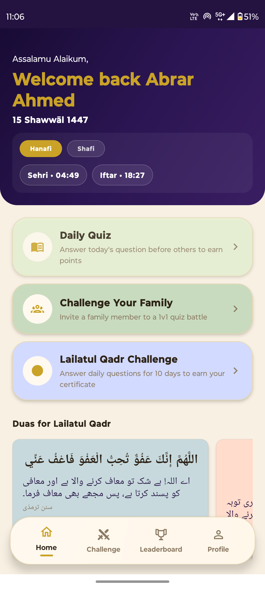
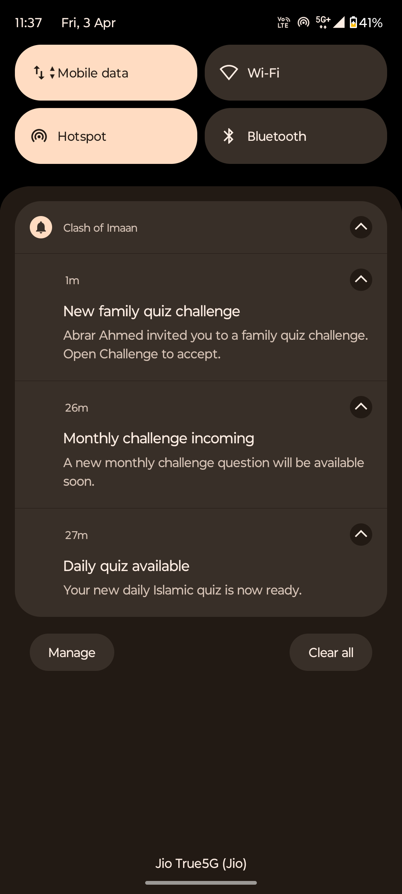
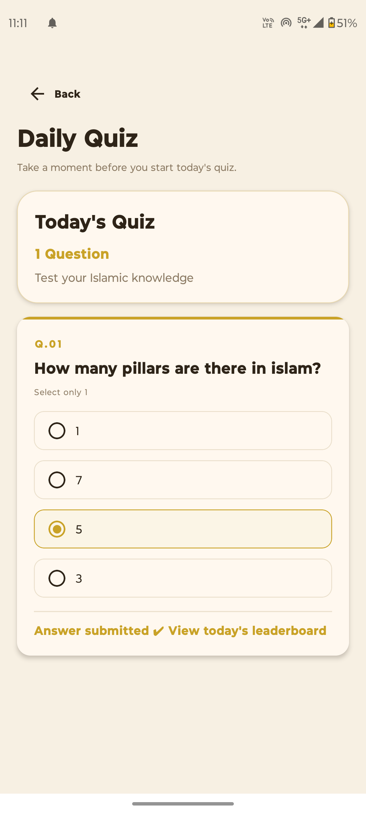
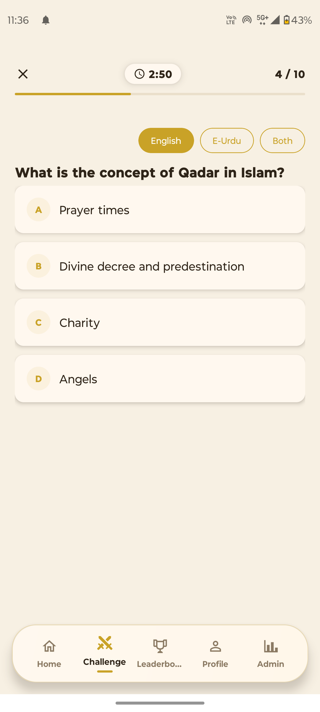
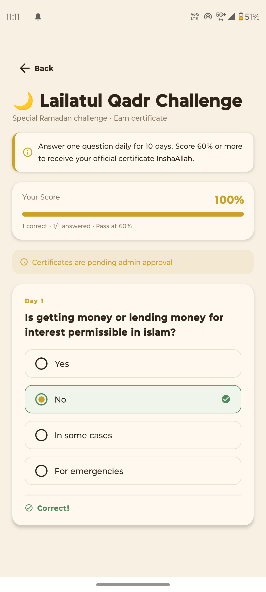
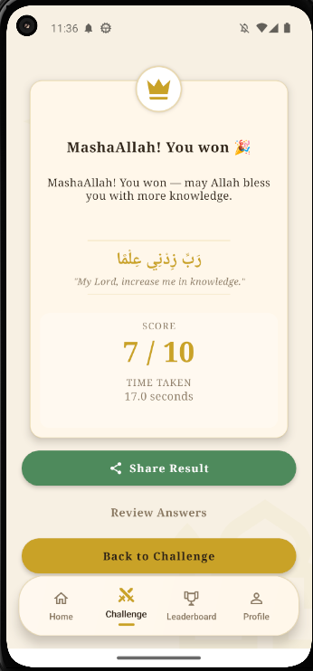
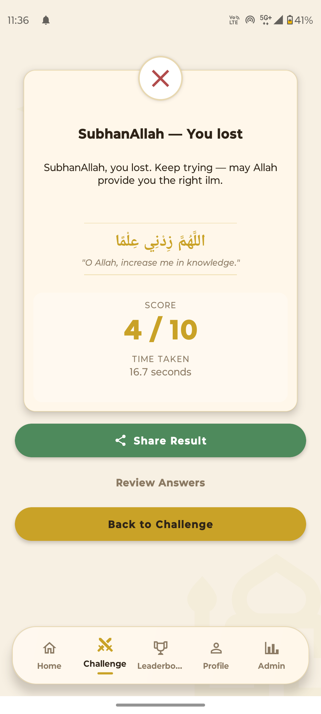
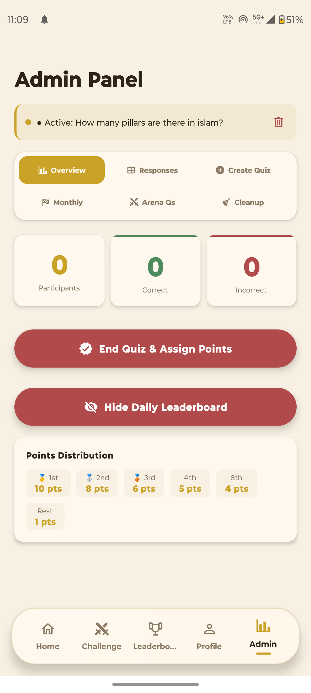
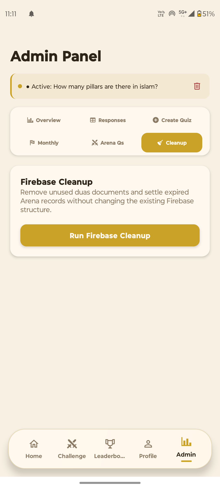

# 🧠 Clash of Imaan – Quiz & Challenge App

A React Native quiz application featuring real-time gameplay, daily challenges, monthly competitions, and 1v1 quiz battles.

---

## 🚀 Features

- 🎯 Daily quiz challenges
- 🏆 Monthly challenge system
- ⚔️ 1v1 real-time quiz battles
- 📊 Leaderboard & scoring system
- 🔔 Notifications
- 👤 User profile management
- ⚙️ Admin panel for quiz control

---

## 🛠 Tech Stack

- React Native CLI
- JavaScript
- Firebase (if used)
- AsyncStorage

---

## 📱 Screenshots

### 👤 User Experience

  
  
  

---

### 🎯 Quiz Modes

  
  
  

---

### ⚔️ Challenge Flow

  
  
  

---

### 🧾 Results

  
  

---

### ⚙️ Admin Panel

  
  
  

---

## 🤔 What I Built

Developed a quiz platform with competitive gameplay including 1v1 battles, daily challenges, and leaderboard tracking.

Focused on handling dynamic quiz flows, real-time interactions, and user engagement through structured scoring and challenge systems.

---

## 🚧 Note

This project is not publicly distributed as an APK. It is intended for demonstration and development purposes.

---

## 👨‍💻 Author

Abrar Ahmed
